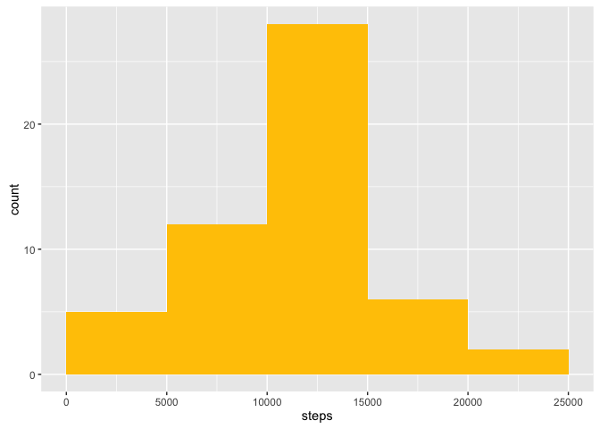
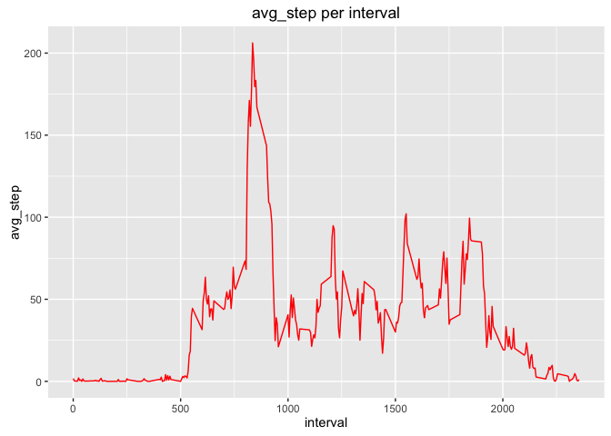
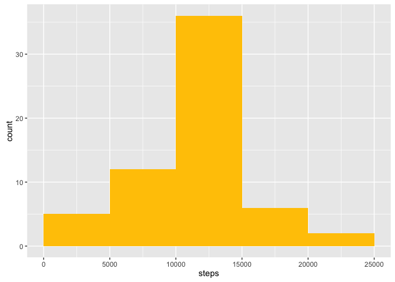
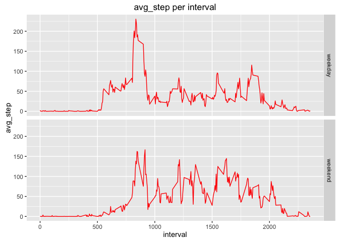

Loading and preprocessing the data

    data<-read.csv('activity.csv',sep=',',header=TRUE,na.strings = NA)
    library(ggplot2)
    col1<-colorRampPalette(c('red','yellow'),alpha=0.3)

What is mean total number of steps taken per day?
-------------------------------------------------

1.Calculate the total number of steps taken per day

    step_day<-aggregate(steps~date,data=data,sum,na.rm=TRUE)

2.Make a histogram of the total number of steps taken each day

    g<-ggplot(data=step_day)
    g+aes(steps)+geom_histogram(breaks=seq(0,25000,by=5000),fill=col1(10)[8])

3.the mean and median of the total number of steps taken per day

    mean(step_day$steps)

    ## [1] 10766.19

    median(step_day$steps)

    ## [1] 10765

    #sum_step_per_day

> the mean of the total number of steps taken per day is
> **1.076618910^{4}**

> the median of the total number of steps taken per day is **10765**

What is the average daily activity pattern?
-------------------------------------------

1.Make a time series plot of the 5-minute interval (x-axis) and the
average number of steps taken, averaged across all days (y-axis)

    step_interval<-aggregate(steps~interval,data=data,mean,na.rm=TRUE)

    g<-ggplot(data=step_interval)
    g+aes(interval,steps)+geom_line(colour=col1(10)[2])+ylab('avg_step')+ggtitle('avg_step per interval')

2.Which 5-minute interval, on average across all the days in the
dataset, contains the maximum number of steps?

    step_interval[which.max(step_interval$steps),]$interval

    ## [1] 835

the maximum number of steps is \_\_835\_\_th

Imputing missing values
-----------------------

1.Calculate and report the total number of missing values in the dataset

    sum(is.na(data$steps))

    ## [1] 2304

the total number of missing values is **2304**

2.Devise a strategy for filling in all of the missing values in the
dataset. The strategy does not need to be sophisticated. For example,
you could use the mean/median for that day, or the mean for that
5-minute interval, etc.

    names(step_interval)<-c('interval','avg_step')
    data1<-merge(data,step_interval,by='interval')

3.Create a new dataset that is equal to the original dataset but with
the missing data filled in.

    data1[is.na(data1$steps),]['steps']<-data1[is.na(data1$steps),]['avg_step']

4.1 Make a histogram of the total number of steps taken each day

    step_day1<-aggregate(steps~date,data=data1,sum,na.rm=TRUE)

    g<-ggplot(data=step_day1)
    g+aes(steps)+geom_histogram(breaks=seq(0,25000,by=5000),fill=col1(10)[8])

4.2 Do these values differ from the estimates from the first part of the
assignment?

**YES!**

4.3 What is the impact of imputing missing data on the estimates of the
total daily number of steps?

**it will be more concentrate on the center of data**

5.Are there differences in activity patterns between weekdays and weekends?
---------------------------------------------------------------------------

1.Create a new factor variable in the dataset with two levels –
“weekday” and “weekend” indicating whether a given date is a weekday or
weekend day.

    data1$weekday=ifelse(as.POSIXlt(as.Date(data1$date))$wday%%6==0,'weekend','weekday')
    data1$day=factor(data1$weekday,levels=c("weekday","weekend"))

2.Make a panel plot containing a time series plot of the 5-minute
interval (x-axis) and the average number of steps taken, averaged across
all weekday days or weekend days (y-axis).

    step_interval1<-aggregate(steps~interval+weekday,data=data1,mean,na.rm=TRUE)

    g<-ggplot(data=step_interval1)
    g+aes(interval,steps)+geom_line(colour=col1(10)[2])+ylab('avg_step')+ggtitle('avg_step per interval')+facet_grid(weekday~.)

See the README file in the GitHub repository to see an example of what
this plot should look like using simulated data.
